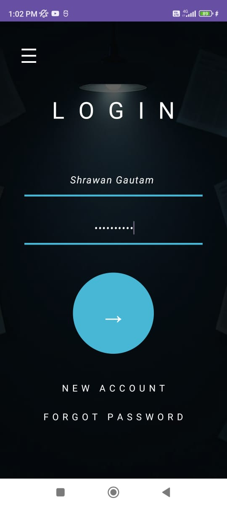

# Experiment 4 – Android Intent Data Passing

## Aim

To develop an Android application with a Login screen that accepts a username and password and passes the entered data from one Activity to another Activity using Android Intent.

---

## Experiment Description

This experiment demonstrates the use of **Intent** in Android application development.

The application consists of two Activities:

1. **MainActivity** – Displays the Login screen and accepts username and password.
2. **SecondActivity** – Receives the username and password from MainActivity and displays the received information.

When the user clicks the Login button, an explicit Intent is created and data is transferred using `putExtra()`.

---

## Concept / Technology Used

### Android Intent

An Intent is a messaging mechanism used in Android to communicate between application components.

In this experiment, an **Explicit Intent** is used to start `SecondActivity` from `MainActivity`.

### Data Passing

Data is passed using:

```kotlin
intent.putExtra("USERNAME", usernameValue)
intent.putExtra("PASSWORD", passwordValue)

# Technologies
Android Studio
Kotlin
XML
Android SDK
Explicit Intent
Material Design Components

Scenario

The application represents a simple login flow.

The user enters:

Username
Password

After pressing the Login button, the application opens the second Activity and displays the received username and password in a formatted account-details screen.

The password is displayed as dots on the second screen for better security and presentation.

#Application Flow
┌───────────────────────┐
│      MainActivity     │
│                       │
│      Login Screen     │
│                       │
│      Username         │
│      Password         │
│                       │
│      Login →          │
└───────────┬───────────┘
            │
            │ Explicit Intent
            │
            │ putExtra()
            ↓
┌───────────────────────┐
│     SecondActivity    │
│                       │
│       Welcome!        │
│                       │
│   Account Details     │
│                       │
│   Username            │
│   Password            │
└───────────────────────┘

#Project Folder Structure

Experiment4_Intent/
│
├── app/
│   ├── src/
│   │   ├── androidTest/
│   │   ├── main/
│   │   │   ├── java/
│   │   │   │   └── com/example/experiment4_intent/
│   │   │   │       ├── MainActivity.kt
│   │   │   │       └── SecondActivity.kt
│   │   │   │
│   │   │   ├── res/
│   │   │   │   ├── drawable/
│   │   │   │   ├── layout/
│   │   │   │   │   ├── activity_main.xml
│   │   │   │   │   └── activity_second.xml
│   │   │   │   ├── mipmap/
│   │   │   │   ├── values/
│   │   │   │   └── xml/
│   │   │   │
│   │   │   └── AndroidManifest.xml
│   │   │
│   │   └── test/
│   │
│   └── build.gradle.kts
│
├── gradle/
├── Screenshots/
│   ├── output_login.png
│   ├── test_case_1.png
│   ├── test_case_2.png
│   └── test_case_3.png
│
├── .gitignore
├── build.gradle.kts
├── gradle.properties
├── gradlew
├── gradlew.bat
└── settings.gradle.kts

Important Files
MainActivity.kt

Responsible for:

Reading username and password.
Creating an explicit Intent.
Passing data to SecondActivity.
Starting SecondActivity.
SecondActivity.kt

Responsible for:

Receiving data from the Intent.
Displaying the username.
Displaying the password in masked form.
activity_main.xml

Defines the Login screen UI.

activity_second.xml

Defines the user details / successful login screen.

AndroidManifest.xml

Registers the Activities used by the application.

# Test Cases

## Test Case 1 – USN and Name

### Input

**Username:** Shrawan Gautam  
**Password:** 25MCAR0229

### Expected Result

The application should open `SecondActivity` and display the username. The password should be displayed in masked form.

### Result

**Pass**

### Screenshot


---

## Test Case 2 – Valid User

### Input

**Username:** Android  
**Password:** Exp4

### Expected Result

The application should successfully transfer the entered information to `SecondActivity` and display the user information.

### Result

**Pass**

### Screenshot


---

## Test Case 3 – Another Valid User

### Input

**Username:** experiment4  
**Password:** Testong

### Expected Result

`SecondActivity` should open successfully and display the received username and masked password.

### Result

**Pass**

### Screenshot


---

# Output

## Login Screen



#Result

The Android application was successfully developed using Kotlin and Android Intent. The username and password were successfully passed from MainActivity to SecondActivity using Intent.putExtra() and retrieved using Intent.getStringExtra().

The application was tested using multiple test cases and the expected output was obtained.
